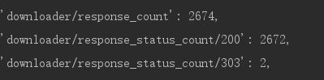

## 使用scrapy框架爬取顶点小说网

**这里用的是scrapy的crawl模板**

**先创建一个scrapy项目，然后再使用crawl模板创建一个crawlSpider**

```
scrapy startproject dingdian  #创建项目
cd dingdian  #进入目录下
scrapy genspider -l  #查看模块
scrapy genspider -t crawl dd www.booktxt.net  #创建了一个crawl模块的scrapy
```

**然后就看到spider文件夹下面有一个dd.py文件，打开就是crawl模块自动生成的代码**

**然后改一下start_urls的链接即爬虫开始的链接为小说的目录界面的url**

**rules 的修改如下，即在allow里面添加每个章节的链接（正则表达式），**

**restrict_xpaths是使用xpath定义的链接范围，**

**callback是回调函数，就是拿到链接之后会使用**

**parse_item函数继续解析，**

**follow是为False是不继续跟进**

```
# -*- coding: utf-8 -*-
import scrapy
from scrapy.linkextractors import LinkExtractor
from scrapy.spiders import CrawlSpider, Rule


class DdSpider(CrawlSpider):
    name = 'dd'
    allowed_domains = ['www.booktxt.net']
    start_urls = ['http://www.booktxt.net/1_1666/']

    rules = (
        Rule(LinkExtractor(allow=r'.*\.html', restrict_xpaths='//div[@id="list"]/dl'), callback='parse_item', follow=False),
    )

    def parse_item(self, response):
        item = {}
        #item['domain_id'] = response.xpath('//input[@id="sid"]/@value').get()
        #item['name'] = response.xpath('//div[@id="name"]').get()
        #item['description'] = response.xpath('//div[@id="description"]').get()
        return item
```

**然后启动scrapy，它会跑起来，并且可以看到已经拿到所有小说章节的URL了**


****

**总共爬取了2674个，2672正常**

**接下来就是解析函数了**

**我们现在items里面定义我们需要提取的字段**

```
from scrapy import Item, Field
    
class DingdianItem(Item):
    title = Field()#标题
    content = Field()#正文
```

**定义了items的两个字段之后，我们在parse_item函数中解析**

```
    def parse_item(self, response):
        item = DingdianItem() #实例item
        item['title'] = response.xpath('//div[@class="bookname"]/h1/text()').extract_first()
        item['content'] = response.xpath('//div[@id="content"]/text()').extract()
        yield item #放回生成器对象
```

**定义item之前记得把items中的DIngdianItem这个类导入进来**

```
from ..items import DingdianItem
```

**这时我们在运行一下scrapy，即可得到标题和正文输出了**


**好了，基本的数据如果可以爬取了，我们就可以在pipelines.py管道文件中进行保存了**

**这里我选择保存在mongodb中**

**pipelines.py代码入下，它原本有一个类在里面，但我们用不上所以删了**

```
import pymongo

class MongoPipeline(object):
    def __init__(self, mongo_uri, mongo_db):
        self.mongo_uri = mongo_uri
        self.mongo_db = mongo_db

    @classmethod
    def from_crawler(cls, crawler):
        return cls(
            mongo_uri=crawler.settings.get('MONGO_URI'),
            mongo_db=crawler.settings.get('MONGO_DB')
        )
    def open_spider(self, spider):
        self.client = pymongo.MongoClient(self.mongo_uri)
        self.db = self.client[self.mongo_db]

    def process_item(self, item, spider):
        self.db['混沌剑神'].insert_one(dict(item))
        return item

    def close_spider(self, spider):
        self.client.close()
```

**在settings.py中打开pipelines入下**

```
ITEM_PIPELINES = {
    'dingdian.pipelines.MongoPipeline': 300,
   # 'dingdian.pipelines.DingdianPipeline': 300,
}
MONGO_URI = 'localhost' #注意别写错成了loaclhost
MONGO_DB = 'dingdian' #要保存的数据库
```

**代码写好了之后我们就可以运行scrapy了**

**打开Terminal终端**

```
cd dingdian
scrapy crawl dd
```

不到2分钟就可以看到运行完成了


**然后我们查看一下数据库有没有数据**

```
show dbs #所有数据库
use dingdian #使用dingdian数据库
show collections #查看数据库下的所有集合
```


**可以看到已经保存到mongo数据库了**

**大功告成**

**2019/5/23更新**
```
    start_urls = ['https://www.booktxt.net/xuanhuanxiaoshuo/']

    rules = (
        Rule(LinkExtractor(allow=r'.*\.html', restrict_xpaths='//div[@id="list"]/dl'), callback='parse_item', follow=False),
        Rule(LinkExtractor(allow=r'net\/.*\/', restrict_xpaths='//div[@class="r"]/ul/li/span/a'), follow=True)
    )
 ```
**把开始时的url改为网站的玄幻小说系列，然后再Rules里面多加一个规则就可以把所有的玄幻系列爬取下来了**
**但是这样爬取还有个问题就是不能按小说名来保存**
 **先把问题放这里过段时间再说**
 ps：也可以进入全本小说那里把所有小说爬下来，网站没有反爬限制
    
